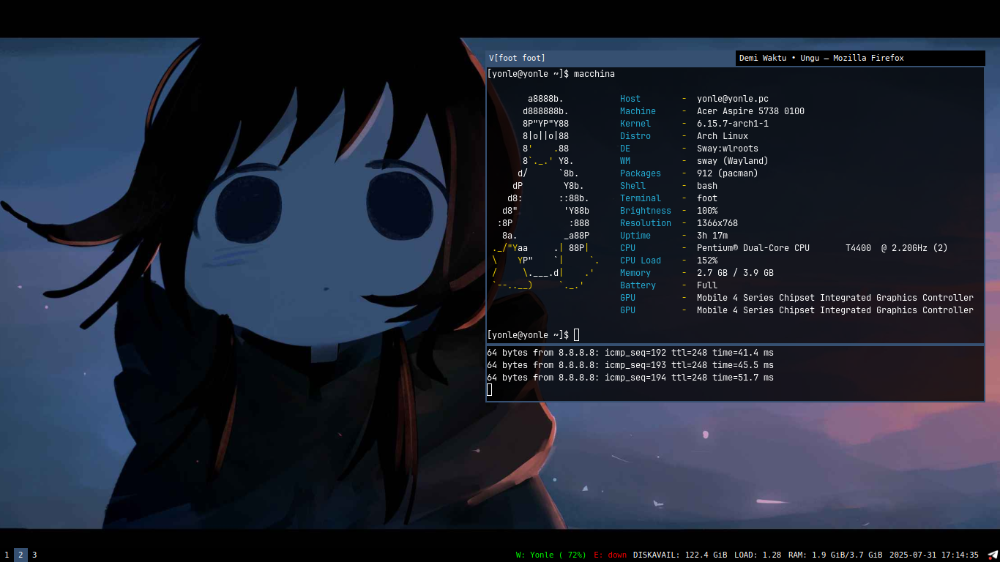
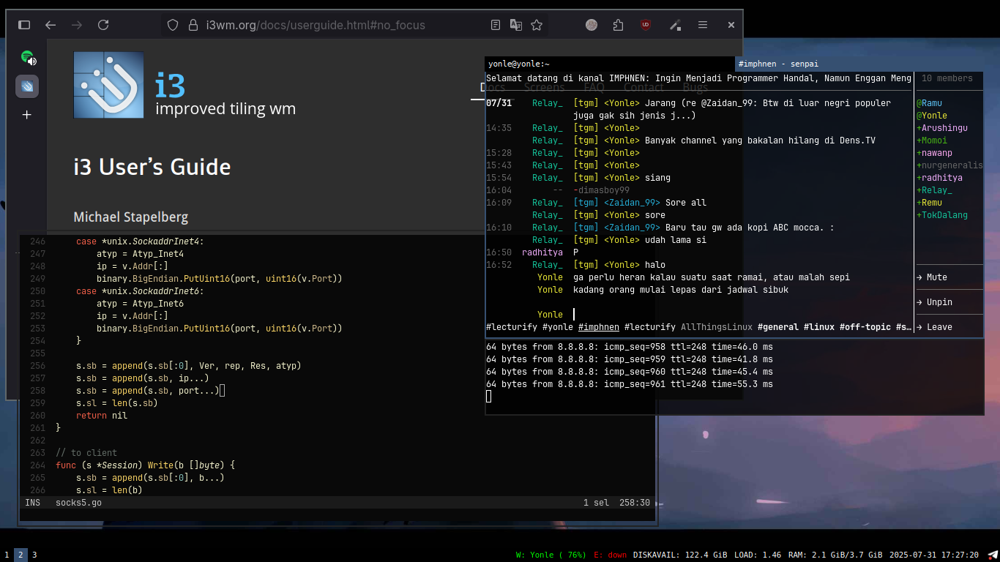

# Sway

Originally made for i3, Reconfigured for sway.

It's mainly made for focusing.

## Wallpaper

By default, It loads a wallpaper that's in `~/.wallpaperimg`.

## Dependencies

- `i3status`
- `thunar` (with additional deps for thumbnail: `tumbler`, `ffmpegthumbnailer`)
- `grim` (with additional deps for getting screen region area: `slurp`)
- `brightnessctl`
- `libpulse` (for `pactl` to control audio)
- `bash`
- `foot` terminal
- `rofi` for app list
- `swaybg` for wallpaper
- `swayidle`
- `swaylock`
- `ttf-dejavu` for main font
- `ttf-jetbrains-mono` for terminal font
- `dex` for autostarting apps / daemon / agent

## Keybinds

Most default sway keybinds is available in the config, With additional changes in mind.

The `$mod` key is Windows (`Mod4`) key.

**Sound controls**:
- Sway's default keybinds for sound control also works.
- `$mod+equal`: Raising up volume by +5%
- `$mod+minus`: Reducing down volume by -5%
- `$mod+m`: Toggle for muting sound

**Brightness controls**:
- Sway's default keybinds for brightness control also works.
- `$mod+F3`: Increase brightness by +10%
- `$mod+F2`: Decrease brightness by -10%

**Workspace controls**:
- `$mod+Page_Up`: Go to the previous workspace
- `$mod+Page_Down`: Go to the next workspace
- `$mod+Delete`: Kill the currently focused window
- `$mod+period` (`$mod+.`): Minimize the currently focused window
- `$mod+slash` (`$mod+/`): Show minimized windows

**Screenshot**:
- `Print`: Screenshot and store it to `~/Pictures/Screenshots/`
- `Shift+Print`: Select a region and screenshot it under the same path as above 

**Miscellaneous**:
- `$mod+Home`: Launch thunar file manager
